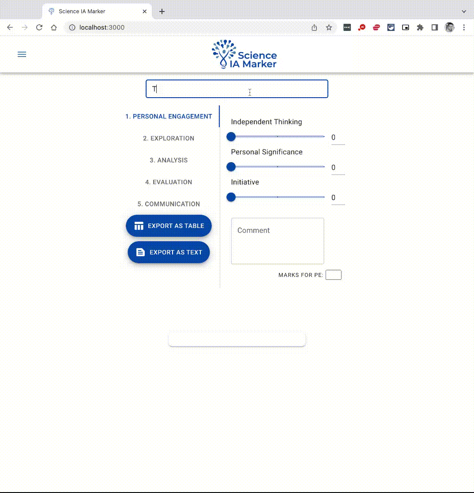
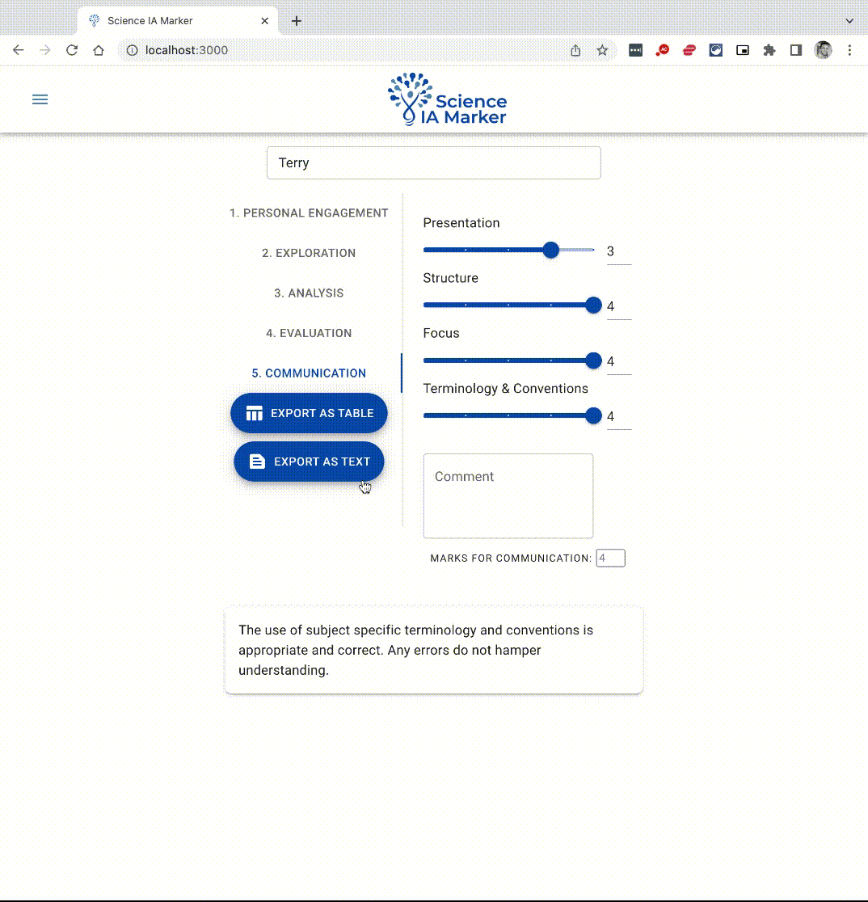

# Science IA Marker

## Description

The Science IA Marker is a tool to assist Science teachers assess and moderate the IB Internal Assessment for the Group 4 Sciences.

The app will will take in input which address the criteria of the Internal Assessment and will output a total score, grade in a table or text summary.

## Techologies

Projects is created with:

- React (MUI V5)
- Redux Toolkit
- React-Router
- use-screenshot-hook (https://github.com/fayeed/use-screenshot)

## Demos and Examples of Use

### Controlling Inputs:

### Controlling Outputs:

